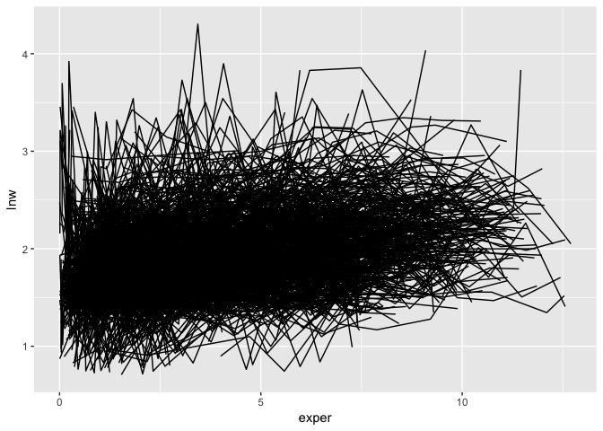
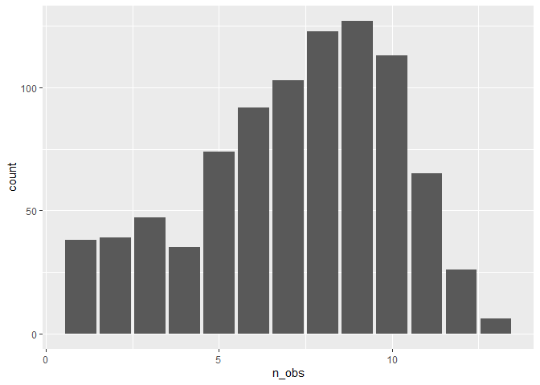
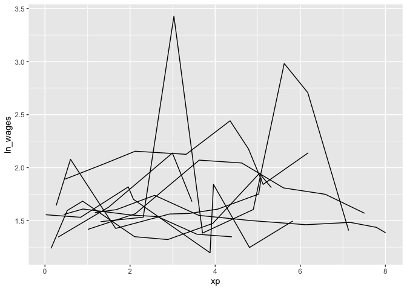
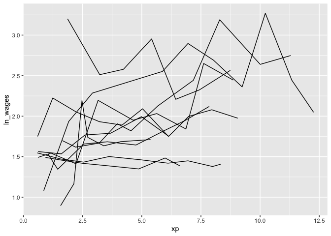
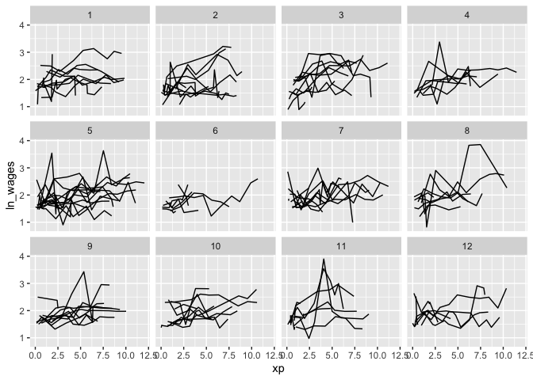
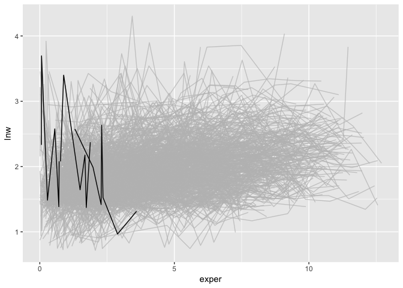
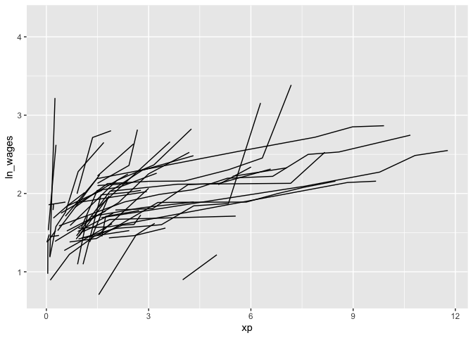

<!-- README.md is generated from README.Rmd. Please edit that file -->

# brolgar

**br**owse **o**ver **l**ongitudinal **d**ata **g**raphically and
**a**nalytically in **R**

<!-- badges: start -->

[](https://travis-ci.org/njtierney/brolgar)
[](https://ci.appveyor.com/project/njtierney/brolgar)
[](https://codecov.io/gh/njtierney/brolgar?branch=master)
[](https://www.tidyverse.org/lifecycle/#experimental)
<!-- badges: end -->

Exploring longitudinal data can be challenging. For example, when there
are many individuals it is difficult to look at all of them, as you
often get a “plate of spaghetti” plot, with many lines plotted on top of
each other.

``` r
library(brolgar)
library(ggplot2)
ggplot(wages_ts, 
       aes(x = xp, 
             y = ln_wages, 
             group = id)) + 
  geom_line()
```



These are hard to interpret.

You might then want to explore those interesting individual lines. Say,
those with high or low variation. But calculating this for individuals
draws you away from your analysis, and instead you are now wrangling
with a different problem: summarising key information about each
individual and incorporating that back into the data.

This is annoying, and distracts from your analysis, inviting errors.

**brolgar** provides tools to calculate statistical summaries for each
individual, and methods to assist you in identifying individuals of
interest.

## Installation

Install from [GitHub](https://github.com/) with:

``` r
# install.packages("remotes")
remotes::install_github("njtierney/brolgar")
```

## Longitudinal data is time series data

A **Big Idea** in `brolgar` is that longitudinal data is a time series.

> Anything that is observed sequentially over time is a time series. –
> [Rob Hyndman and George Athanasopolous (Forecasting: Principles and
> Practice)](https://otexts.com/fpp2/data-methods.html)

Once we account for this time series structure inherent in longitudinal
data, we gain access to a suite of nice tools that simplify and
accelerate how we work with time series data.

## Converting your longitudinal data to a time series

To convert longitudinal data into a “**t**ime **s**eries tibble”, a
`tsibble`, we need to consider:

  - What identifies the **time** component of the data? This is the
    **index**
  - What is the **unique identifier** of an individual/series? This is
    the **key**

Together, the **index** and **key** uniquely identify an observation.

What do we mean by this? Let’s look at the first section of the wages,
**wages** data analysed in Singer & Willett (2003):

``` r
library(dplyr)
#> 
#> Attaching package: 'dplyr'
#> The following objects are masked from 'package:stats':
#> 
#>     filter, lag
#> The following objects are masked from 'package:base':
#> 
#>     intersect, setdiff, setequal, union
slice(wages_ts, 1:10)
#> # A tsibble: 10 x 9 [!]
#> # Key:       id [2]
#>       id ln_wages    xp   ged postexp black hispanic high_grade
#>    <int>    <dbl> <dbl> <int>   <dbl> <int>    <int>      <int>
#>  1    31     1.49 0.015     1   0.015     0        1          8
#>  2    31     1.43 0.715     1   0.715     0        1          8
#>  3    31     1.47 1.73      1   1.73      0        1          8
#>  4    31     1.75 2.77      1   2.77      0        1          8
#>  5    31     1.93 3.93      1   3.93      0        1          8
#>  6    31     1.71 4.95      1   4.95      0        1          8
#>  7    31     2.09 5.96      1   5.96      0        1          8
#>  8    31     2.13 6.98      1   6.98      0        1          8
#>  9    36     1.98 0.315     1   0.315     0        0          9
#> 10    36     1.80 0.983     1   0.983     0        0          9
#> # … with 1 more variable: unemploy_rate <dbl>
```

We have the `id` column, which identifies an individual.

We also have the `xp` column, which identifies the experience an
individual has.

So:

  - key: `id`
  - index: `exper`

We could create a `tsibble` of this data by using the `as_tsibble`
function from `tsibble`, also stating, `regular = FALSE`, since we have
an `irregular` time series:

``` r
library(tsibble)
#> 
#> Attaching package: 'tsibble'
#> The following object is masked from 'package:dplyr':
#> 
#>     id
as_tsibble(x = wages_ts,
           key = id,
           index = xp,
           regular = FALSE)
#> # A tsibble: 6,402 x 9 [!]
#> # Key:       id [888]
#>       id ln_wages    xp   ged postexp black hispanic high_grade
#>    <int>    <dbl> <dbl> <int>   <dbl> <int>    <int>      <int>
#>  1    31     1.49 0.015     1   0.015     0        1          8
#>  2    31     1.43 0.715     1   0.715     0        1          8
#>  3    31     1.47 1.73      1   1.73      0        1          8
#>  4    31     1.75 2.77      1   2.77      0        1          8
#>  5    31     1.93 3.93      1   3.93      0        1          8
#>  6    31     1.71 4.95      1   4.95      0        1          8
#>  7    31     2.09 5.96      1   5.96      0        1          8
#>  8    31     2.13 6.98      1   6.98      0        1          8
#>  9    36     1.98 0.315     1   0.315     0        0          9
#> 10    36     1.80 0.983     1   0.983     0        0          9
#> # … with 6,392 more rows, and 1 more variable: unemploy_rate <dbl>
```

Note the following information printed at the top of `wages_ts`

    # A tsibble: 6,402 x 9 [!]
    # Key:       id [888]
    ...

This says, we have 6402 rows, with 9 columns. The `!` means that there
is no regular spacing between series, and then our “key” is `id`, of
which there 888.

## Quickly exploring longitudinal data

### `n_key_obs()`

We can calculate the number of observations for each `key`, using
`n_key_obs()`:

``` r
n_key_obs(wages_ts)
#> # A tibble: 888 x 2
#>       id n_obs
#>    <int> <int>
#>  1    31     8
#>  2    36    10
#>  3    53     8
#>  4   122    10
#>  5   134    12
#>  6   145     9
#>  7   155    11
#>  8   173     6
#>  9   206     3
#> 10   207    11
#> # … with 878 more rows
```

This returns a dataframe, with one row per key, and the number of
observations for each key.

This could be further summarised to get a sense of the patterns of the
number of observations:

``` r
library(ggplot2)
n_key_obs(wages_ts) %>%
ggplot(aes(x = n_obs)) + 
  geom_bar()
```



``` r

n_key_obs(wages_ts) %>% summary()
#>        id            n_obs       
#>  Min.   :   31   Min.   : 1.000  
#>  1st Qu.: 3332   1st Qu.: 5.000  
#>  Median : 6666   Median : 8.000  
#>  Mean   : 6343   Mean   : 7.209  
#>  3rd Qu.: 9194   3rd Qu.: 9.000  
#>  Max.   :12543   Max.   :13.000
```

### `add_n_key_obs()`

You can add information about the number of observations for each key
with `add_n_key_obs()`:

``` r
wages_ts %>% add_n_key_obs()
#> # A tsibble: 6,402 x 10 [!]
#> # Key:       id [888]
#>       id ln_wages    xp   ged postexp black hispanic high_grade
#>    <int>    <dbl> <dbl> <int>   <dbl> <int>    <int>      <int>
#>  1    31     1.49 0.015     1   0.015     0        1          8
#>  2    31     1.43 0.715     1   0.715     0        1          8
#>  3    31     1.47 1.73      1   1.73      0        1          8
#>  4    31     1.75 2.77      1   2.77      0        1          8
#>  5    31     1.93 3.93      1   3.93      0        1          8
#>  6    31     1.71 4.95      1   4.95      0        1          8
#>  7    31     2.09 5.96      1   5.96      0        1          8
#>  8    31     2.13 6.98      1   6.98      0        1          8
#>  9    36     1.98 0.315     1   0.315     0        0          9
#> 10    36     1.80 0.983     1   0.983     0        0          9
#> # … with 6,392 more rows, and 2 more variables: unemploy_rate <dbl>,
#> #   n_obs <int>
```

Which you can then use to filter observations:

``` r
wages_ts %>% 
  add_n_key_obs() %>%
  filter(n_obs > 3)
#> # A tsibble: 6,145 x 10 [!]
#> # Key:       id [764]
#>       id ln_wages    xp   ged postexp black hispanic high_grade
#>    <int>    <dbl> <dbl> <int>   <dbl> <int>    <int>      <int>
#>  1    31     1.49 0.015     1   0.015     0        1          8
#>  2    31     1.43 0.715     1   0.715     0        1          8
#>  3    31     1.47 1.73      1   1.73      0        1          8
#>  4    31     1.75 2.77      1   2.77      0        1          8
#>  5    31     1.93 3.93      1   3.93      0        1          8
#>  6    31     1.71 4.95      1   4.95      0        1          8
#>  7    31     2.09 5.96      1   5.96      0        1          8
#>  8    31     2.13 6.98      1   6.98      0        1          8
#>  9    36     1.98 0.315     1   0.315     0        0          9
#> 10    36     1.80 0.983     1   0.983     0        0          9
#> # … with 6,135 more rows, and 2 more variables: unemploy_rate <dbl>,
#> #   n_obs <int>
```

Alternatively, you can use the shortcut, `filter_n_obs()`:

``` r
wages_ts %>% 
  filter_n_obs(n_obs > 3)
#> # A tsibble: 6,145 x 10 [!]
#> # Key:       id [764]
#>       id ln_wages    xp   ged postexp black hispanic high_grade
#>    <int>    <dbl> <dbl> <int>   <dbl> <int>    <int>      <int>
#>  1    31     1.49 0.015     1   0.015     0        1          8
#>  2    31     1.43 0.715     1   0.715     0        1          8
#>  3    31     1.47 1.73      1   1.73      0        1          8
#>  4    31     1.75 2.77      1   2.77      0        1          8
#>  5    31     1.93 3.93      1   3.93      0        1          8
#>  6    31     1.71 4.95      1   4.95      0        1          8
#>  7    31     2.09 5.96      1   5.96      0        1          8
#>  8    31     2.13 6.98      1   6.98      0        1          8
#>  9    36     1.98 0.315     1   0.315     0        0          9
#> 10    36     1.80 0.983     1   0.983     0        0          9
#> # … with 6,135 more rows, and 2 more variables: unemploy_rate <dbl>,
#> #   n_obs <int>
```

### `sample_n_keys()`

You can take a random sample of `n` keys using `sample_n_keys()`:

``` r
set.seed(2019-7-15-1300)
wages_ts %>%
  sample_n_keys(size = 10) %>%
  ggplot(aes(x = xp,
             y = ln_wages,
             group = id)) + 
  geom_line()
```



You could also combine with this `filter_n_obs` to only show keys with
many observations:

``` r
set.seed(2019-7-15-1259)
wages_ts %>%
  filter_n_obs(n_obs > 5) %>%
  sample_n_keys(size = 10) %>%
  ggplot(aes(x = xp,
             y = ln_wages,
             group = id)) + 
  geom_line()
```



There is also `sample_frac_keys()`, which allows for sampling a fraction
of available keys.

### `stratify_keys()`

In keeping in the spirit of wanting to look at as much of the raw data
as possible, it can be helpful to stratify the data into groups for
plotting. You can `stratify` the `keys` using the `stratify_keys()`
function, which adds the column, `.strata`:

``` r
wages_ts %>%
  sample_n_keys(100) %>% 
  stratify_keys(n_strata = 10)
#> # A tsibble: 737 x 10 [!]
#> # Key:       id [100]
#>       id ln_wages    xp   ged postexp black hispanic high_grade
#>    <int>    <dbl> <dbl> <int>   <dbl> <int>    <int>      <int>
#>  1    53     1.76 0.781     0   0         0        1          7
#>  2    53     1.54 0.943     0   0         0        1          7
#>  3    53     3.24 0.957     1   0         0        1          7
#>  4    53     1.60 1.04      1   0.08      0        1          7
#>  5    53     1.57 1.06      1   0.1       0        1          7
#>  6    53     1.88 1.11      1   0.152     0        1          7
#>  7    53     1.89 1.18      1   0.227     0        1          7
#>  8    53     1.66 1.78      1   0.82      0        1          7
#>  9   145     1.56 0.235     0   0         0        0         10
#> 10   145     1.48 0.828     1   0.473     0        0         10
#> # … with 727 more rows, and 2 more variables: unemploy_rate <dbl>,
#> #   .strata <int>
```

This then allows the user to create facetted plots showing a lot more of
the raw data

``` r
set.seed(2019-07-15-1258)
wages_ts %>%
  sample_n_keys(120) %>% 
  stratify_keys(n_strata = 12) %>%
  ggplot(aes(x = xp,
             y = ln_wages,
             group = id)) + 
  geom_line() + 
  facet_wrap(~.strata)
```



## Exploratory modelling

You can fit a linear model for each key using `key_slope()`. This
returns the intercept and slope estimate for each key, given some linear
model formula.

We can get the number of observations, and slope information for each
individual to identify those that are decreasing over time.

``` r
sl <- key_slope(wages_ts,ln_wages ~ xp)
ns <- n_key_obs(wages_ts)

sl
#> # A tibble: 888 x 3
#>       id .intercept .slope_xp
#>    <int>      <dbl>     <dbl>
#>  1    31       1.41    0.101 
#>  2    36       2.04    0.0588
#>  3    53       2.29   -0.358 
#>  4   122       1.93    0.0374
#>  5   134       2.03    0.0831
#>  6   145       1.59    0.0469
#>  7   155       1.66    0.0867
#>  8   173       1.61    0.100 
#>  9   206       1.73    0.180 
#> 10   207       1.62    0.0884
#> # … with 878 more rows
ns
#> # A tibble: 888 x 2
#>       id n_obs
#>    <int> <int>
#>  1    31     8
#>  2    36    10
#>  3    53     8
#>  4   122    10
#>  5   134    12
#>  6   145     9
#>  7   155    11
#>  8   173     6
#>  9   206     3
#> 10   207    11
#> # … with 878 more rows
```

We can then join these summaries back to the data:

``` r
wages_lg <- wages_ts %>%
  left_join(sl, by = "id") %>%
  left_join(ns, by = "id")

wages_lg
#> # A tsibble: 6,402 x 12 [!]
#> # Key:       id [888]
#>       id ln_wages    xp   ged postexp black hispanic high_grade
#>    <int>    <dbl> <dbl> <int>   <dbl> <int>    <int>      <int>
#>  1    31     1.49 0.015     1   0.015     0        1          8
#>  2    31     1.43 0.715     1   0.715     0        1          8
#>  3    31     1.47 1.73      1   1.73      0        1          8
#>  4    31     1.75 2.77      1   2.77      0        1          8
#>  5    31     1.93 3.93      1   3.93      0        1          8
#>  6    31     1.71 4.95      1   4.95      0        1          8
#>  7    31     2.09 5.96      1   5.96      0        1          8
#>  8    31     2.13 6.98      1   6.98      0        1          8
#>  9    36     1.98 0.315     1   0.315     0        0          9
#> 10    36     1.80 0.983     1   0.983     0        0          9
#> # … with 6,392 more rows, and 4 more variables: unemploy_rate <dbl>,
#> #   .intercept <dbl>, .slope_xp <dbl>, n_obs <int>
```

And highlight those individuals with more than 5 observations, and
highlight those with a negative slope using `gghighlight`:

``` r
library(gghighlight)

wages_lg %>% 
  filter(n_obs > 5) %>%
  ggplot(aes(x = xp, 
             y = ln_wages, 
             group = id)) + 
  geom_line() +
  gghighlight(.slope_xp < 0,
              use_direct_label = FALSE)
#> Warning: Unspecified temporal ordering may yield unexpected results.
#> Suggest to sort by `id`, `xp` first.
```



### `keys_near()`

## Finding features in longitudinal data

You can extract `features` of longitudinal data using the `features`
function, which is imported from `fablelite` and `feasts`. You can, for
example, calculate the minimum of a given variable for each key by
providing a named list like so:

``` r
wages_ts %>%
  features(ln_wages, 
           list(min = min))
#> # A tibble: 888 x 2
#>       id   min
#>    <int> <dbl>
#>  1    31 1.43 
#>  2    36 1.80 
#>  3    53 1.54 
#>  4   122 0.763
#>  5   134 2.00 
#>  6   145 1.48 
#>  7   155 1.54 
#>  8   173 1.56 
#>  9   206 2.03 
#> 10   207 1.58 
#> # … with 878 more rows
```

You want to get the first and last values using `dplyr::first` and
`dplyr::last`

``` r
library(dplyr)

wages_ts %>%
  features(ln_wages, 
           list(first = first,
                last = last))
#> # A tibble: 888 x 3
#>       id first  last
#>    <int> <dbl> <dbl>
#>  1    31  1.49  2.13
#>  2    36  1.98  2.33
#>  3    53  1.76  1.66
#>  4   122  2.12  2.67
#>  5   134  2.00  2.76
#>  6   145  1.56  1.91
#>  7   155  1.78  2.64
#>  8   173  1.56  2.34
#>  9   206  2.03  2.48
#> 10   207  1.58  2.26
#> # … with 878 more rows
```

`brolgar` provides some helper features. For example, creating the five
number summary:

``` r
wages_ts %>%
  features(ln_wages, feat_five_num)
#> # A tibble: 888 x 6
#>       id   min   q25   med  q_75   max
#>    <int> <dbl> <dbl> <dbl> <dbl> <dbl>
#>  1    31 1.43   1.48  1.73  2.02  2.13
#>  2    36 1.80   1.97  2.32  2.59  2.93
#>  3    53 1.54   1.58  1.71  1.89  3.24
#>  4   122 0.763  2.10  2.19  2.46  2.92
#>  5   134 2.00   2.28  2.36  2.79  2.93
#>  6   145 1.48   1.58  1.77  1.89  2.04
#>  7   155 1.54   1.83  2.22  2.44  2.64
#>  8   173 1.56   1.68  2.00  2.05  2.34
#>  9   206 2.03   2.07  2.30  2.45  2.48
#> 10   207 1.58   1.87  2.15  2.26  2.66
#> # … with 878 more rows
```

Or finding those whose values only increase or decrease with `monotonic`

``` r
wages_ts %>%
  features(ln_wages, feat_monotonic)
#> # A tibble: 888 x 4
#>       id increase decrease unvary
#>    <int> <lgl>    <lgl>    <lgl> 
#>  1    31 FALSE    FALSE    FALSE 
#>  2    36 FALSE    FALSE    FALSE 
#>  3    53 FALSE    FALSE    FALSE 
#>  4   122 FALSE    FALSE    FALSE 
#>  5   134 FALSE    FALSE    FALSE 
#>  6   145 FALSE    FALSE    FALSE 
#>  7   155 FALSE    FALSE    FALSE 
#>  8   173 FALSE    FALSE    FALSE 
#>  9   206 TRUE     FALSE    FALSE 
#> 10   207 FALSE    FALSE    FALSE 
#> # … with 878 more rows
```

## Linking individuals back to the data

You can join these features back to the data with `left_join`, like so:

``` r
wages_ts %>%
  features(ln_wages, feat_monotonic) %>%
  left_join(wages_ts, by = "id") %>%
  filter(increase) %>%
  ggplot(aes(x = xp,
             y = ln_wages,
             group = id)) +
  geom_line()
```



# A Note on the API

This version of brolgar was been forked from
[tprvan/brolgar](https://github.com/tprvan/brolgar), and has undergone
breaking changes to the API.

<!-- These are referred to as a **longnostics**, a portmanteau of **long**itudinal and **cognostic**. These **longnostics** make it straightforward to extract subjects with certain properties to gain some insight into the data.  -->
