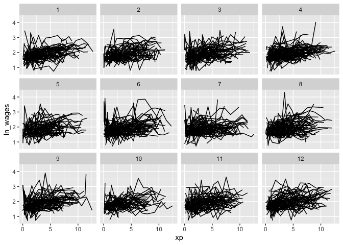
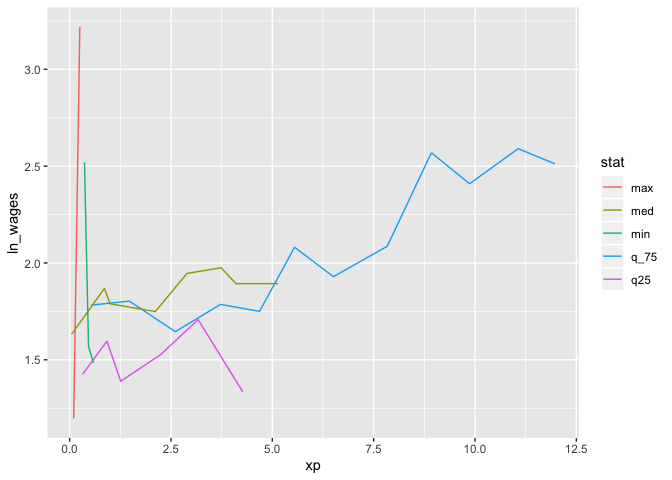

<!-- README.md is generated from README.Rmd. Please edit that file -->

# brolgar

<!-- badges: start -->

[](https://www.tidyverse.org/lifecycle/#experimental)
[](https://travis-ci.org/njtierney/brolgar)
[](https://ci.appveyor.com/project/njtierney/brolgar)
[](https://codecov.io/gh/njtierney/brolgar?branch=master)
<!-- badges: end -->

`brolgar` helps you **br**owse **o**ver **l**ongitudinal **d**ata
**g**raphically and **a**nalytically in **R**, by providing tools to:

  - Efficiently explore your raw data
  - Calculate features (summaries) for each individual series
  - Evaluate diagnostics of statistical models

This helps you go from the “plate of spaghetti” plot on the left, to
“interesting observations” plot on the left.


## Installation

Install from [GitHub](https://github.com/) with:

``` r
# install.packages("remotes")
remotes::install_github("njtierney/brolgar")
```

# Using `brolgar`: We need to talk about data

To efficiently look at your longitudinal data, we assume it **is a time
series**, with **irregular** time periods between measurements. This
might seem strange, (that’s OK\!), so **remember these two things**:

1.  The **key** variable in your data is the **identifier** of your
    individuals or series.
2.  The **index** variable is the **time** component of your data.

Together, the **index** and **key** uniquely identify an observation.

The term `key` is used a lot in brolgar, so it is an important idea to
internalise:

> **The key is the identifier of your individuals or series**

So in the `wages` data, we have the following setup:

``` r
wages <- as_tsibble(x = wages,
                       key = id,
                       index = xp,
                       regular = FALSE)
```

If you want to learn more about what longitudinal data as a time series,
you can [read more in the vignette, “Longitudinal Data
Structures”](library/brolgar/html/longitudinal-data-structures.html)

## Efficiently exploring longitudinal data

Exploring longitudinal data can be challenging when there are many
individuals. It is difficult to look at all of them\!

You often get a “plate of spaghetti” plot, with many lines plotted on
top of each other. To avoid the spaghetti by looking at a random subset
of the data using tools in `brolgar`.

### `sample_n_keys()`

In `dplyr`, you can use `sample_n()` to sample `n` observations, or
`sample_frac()` to look at a `frac`tion of observations.

`brolgar` builds on this providing `sample_n_keys()` and
`sample_frac_keys()`. This allos you to take a random sample of `n` keys
using `sample_n_keys()`, for example:

``` r
set.seed(2019-7-15-1300)
wages %>%
  sample_n_keys(size = 5) %>%
  ggplot(aes(x = xp,
             y = ln_wages,
             group = id)) + 
  geom_line()
```


But how do you break these into many plots?

## Clever facets: `facet_strata()`

`brolgar` provides some clever facets to help make it easier to explore
your data. `facet_strata()` splits the data into 12 groups by default:

``` r
set.seed(2019-07-23-1936)
library(ggplot2)
ggplot(wages,
       aes(x = xp,
           y = ln_wages,
           group = id)) +
  geom_line() +
  facet_strata()
```



And if you want to show only a few samples per facet, you can use
`facet_sample()`

## Clever facets: `facet_sample()`

`facet_sample()` allows you to specify the number of keys per facet, and
the number of facets with `n_per_facet` and `n_facets`. It splits the
data into 12 facets with 5 per facet by default:

``` r
set.seed(2019-07-23-1937)
ggplot(wages,
       aes(x = xp,
           y = ln_wages,
           group = id)) +
  geom_line() +
  facet_sample()
```


Under the hood, `facet_sample()` and `facet_strata()` use
`sample_n_keys()` and `stratify_keys()`.

## Finding features in longitudinal data

You can extract `features` of longitudinal data using the `features`
function, from `fabletools`. You can, for example, calculate the minimum
of a given variable for each key by providing a named list like so:

``` r
wages %>%
  features(ln_wages, 
           list(min = min))
#> # A tibble: 888 x 2
#>       id   min
#>    <int> <dbl>
#>  1    31 1.43 
#>  2    36 1.80 
#>  3    53 1.54 
#>  4   122 0.763
#>  5   134 2.00 
#>  6   145 1.48 
#>  7   155 1.54 
#>  8   173 1.56 
#>  9   206 2.03 
#> 10   207 1.58 
#> # … with 878 more rows
```

`brolgar` provides some sets of features, which start with `feat_`.

For example, finding those whose values only increase or decrease with
`feat_monotonic`

``` r
wages %>%
  features(ln_wages, feat_monotonic)
#> # A tibble: 888 x 5
#>       id increase decrease unvary monotonic
#>    <int> <lgl>    <lgl>    <lgl>  <lgl>    
#>  1    31 FALSE    FALSE    FALSE  FALSE    
#>  2    36 FALSE    FALSE    FALSE  FALSE    
#>  3    53 FALSE    FALSE    FALSE  FALSE    
#>  4   122 FALSE    FALSE    FALSE  FALSE    
#>  5   134 FALSE    FALSE    FALSE  FALSE    
#>  6   145 FALSE    FALSE    FALSE  FALSE    
#>  7   155 FALSE    FALSE    FALSE  FALSE    
#>  8   173 FALSE    FALSE    FALSE  FALSE    
#>  9   206 TRUE     FALSE    FALSE  TRUE     
#> 10   207 FALSE    FALSE    FALSE  FALSE    
#> # … with 878 more rows
```

## Linking individuals back to the data

You can join these features back to the data with `left_join`, like so:

``` r
wages %>%
  features(ln_wages, feat_monotonic) %>%
  left_join(wages, by = "id") %>%
  ggplot(aes(x = xp,
             y = ln_wages,
             group = id)) +
  geom_line() + 
  gghighlight(increase)
```


## Other helper functions

### `n_obs()`

We can calculate the number of observations total using `n_obs()`:

``` r
n_obs(wages)
#> n_obs 
#>  6402
```

And the number of keys in the data using `n_keys()`:

``` r
n_keys(wages)
#> [1] 888
```

You can also use `n_obs()` inside features to return the number of
observations:

``` r
wages %>%
  features(id, n_obs)
#> # A tibble: 888 x 2
#>       id n_obs
#>    <int> <int>
#>  1    31     8
#>  2    36    10
#>  3    53     8
#>  4   122    10
#>  5   134    12
#>  6   145     9
#>  7   155    11
#>  8   173     6
#>  9   206     3
#> 10   207    11
#> # … with 878 more rows
```

This returns a dataframe, with one row per key, and the number of
observations for each key.

This could be further summarised to get a sense of the patterns of the
number of observations:

``` r
library(ggplot2)
wages %>%
  features(id, n_obs) %>%
ggplot(aes(x = n_obs)) + 
  geom_bar()
```


``` r

wages %>%
  features(id, n_obs) %>%
  summary()
#>        id            n_obs       
#>  Min.   :   31   Min.   : 1.000  
#>  1st Qu.: 3332   1st Qu.: 5.000  
#>  Median : 6666   Median : 8.000  
#>  Mean   : 6343   Mean   : 7.209  
#>  3rd Qu.: 9194   3rd Qu.: 9.000  
#>  Max.   :12543   Max.   :13.000
```

### `add_n_obs()`

You can add information about the number of observations for each key
with `add_n_obs()`:

``` r
wages %>% add_n_obs()
#> # A tsibble: 6,402 x 10 [!]
#> # Key:       id [888]
#>       id    xp n_obs ln_wages   ged xp_since_ged black hispanic high_grade
#>    <int> <dbl> <int>    <dbl> <int>        <dbl> <int>    <int>      <int>
#>  1    31 0.015     8     1.49     1        0.015     0        1          8
#>  2    31 0.715     8     1.43     1        0.715     0        1          8
#>  3    31 1.73      8     1.47     1        1.73      0        1          8
#>  4    31 2.77      8     1.75     1        2.77      0        1          8
#>  5    31 3.93      8     1.93     1        3.93      0        1          8
#>  6    31 4.95      8     1.71     1        4.95      0        1          8
#>  7    31 5.96      8     2.09     1        5.96      0        1          8
#>  8    31 6.98      8     2.13     1        6.98      0        1          8
#>  9    36 0.315    10     1.98     1        0.315     0        0          9
#> 10    36 0.983    10     1.80     1        0.983     0        0          9
#> # … with 6,392 more rows, and 1 more variable: unemploy_rate <dbl>
```

Which you can then use to filter observations:

``` r
wages %>% 
  add_n_obs() %>%
  filter(n_obs > 3)
#> # A tsibble: 6,145 x 10 [!]
#> # Key:       id [764]
#>       id    xp n_obs ln_wages   ged xp_since_ged black hispanic high_grade
#>    <int> <dbl> <int>    <dbl> <int>        <dbl> <int>    <int>      <int>
#>  1    31 0.015     8     1.49     1        0.015     0        1          8
#>  2    31 0.715     8     1.43     1        0.715     0        1          8
#>  3    31 1.73      8     1.47     1        1.73      0        1          8
#>  4    31 2.77      8     1.75     1        2.77      0        1          8
#>  5    31 3.93      8     1.93     1        3.93      0        1          8
#>  6    31 4.95      8     1.71     1        4.95      0        1          8
#>  7    31 5.96      8     2.09     1        5.96      0        1          8
#>  8    31 6.98      8     2.13     1        6.98      0        1          8
#>  9    36 0.315    10     1.98     1        0.315     0        0          9
#> 10    36 0.983    10     1.80     1        0.983     0        0          9
#> # … with 6,135 more rows, and 1 more variable: unemploy_rate <dbl>
```

## Exploratory modelling

It can be useful to fit a model to explore your data. One technique is
to fit a linear model for each group in a dataset. For example, you
could fit a linear model for each key in the data.

`brolgar` provides a simple helper function to help with this, called
`key_slope()`.

`key_slope()` returns the intercept and slope estimate for each key,
given a linear model formula. We can get the number of observations, and
slope information for each individual to identify those that are
decreasing over time.

``` r
key_slope(wages,ln_wages ~ xp)
#> # A tibble: 888 x 3
#>       id .intercept .slope_xp
#>    <int>      <dbl>     <dbl>
#>  1    31       1.41    0.101 
#>  2    36       2.04    0.0588
#>  3    53       2.29   -0.358 
#>  4   122       1.93    0.0374
#>  5   134       2.03    0.0831
#>  6   145       1.59    0.0469
#>  7   155       1.66    0.0867
#>  8   173       1.61    0.100 
#>  9   206       1.73    0.180 
#> 10   207       1.62    0.0884
#> # … with 878 more rows
```

We can then join these summaries back to the data:

``` r
library(dplyr)
wages_slope <- key_slope(wages,ln_wages ~ xp) %>%
  left_join(wages, by = "id") 

wages_slope
#> # A tibble: 6,402 x 11
#>       id .intercept .slope_xp ln_wages    xp   ged xp_since_ged black
#>    <int>      <dbl>     <dbl>    <dbl> <dbl> <int>        <dbl> <int>
#>  1    31       1.41    0.101      1.49 0.015     1        0.015     0
#>  2    31       1.41    0.101      1.43 0.715     1        0.715     0
#>  3    31       1.41    0.101      1.47 1.73      1        1.73      0
#>  4    31       1.41    0.101      1.75 2.77      1        2.77      0
#>  5    31       1.41    0.101      1.93 3.93      1        3.93      0
#>  6    31       1.41    0.101      1.71 4.95      1        4.95      0
#>  7    31       1.41    0.101      2.09 5.96      1        5.96      0
#>  8    31       1.41    0.101      2.13 6.98      1        6.98      0
#>  9    36       2.04    0.0588     1.98 0.315     1        0.315     0
#> 10    36       2.04    0.0588     1.80 0.983     1        0.983     0
#> # … with 6,392 more rows, and 3 more variables: hispanic <int>,
#> #   high_grade <int>, unemploy_rate <dbl>
```

And highlight those individuals with a negative slope using
`gghighlight`:

``` r
library(gghighlight)

wages_slope %>% 
  as_tibble() %>% # workaround for gghighlight + tsibble
  ggplot(aes(x = xp, 
             y = ln_wages, 
             group = id)) + 
  geom_line() +
  gghighlight(.slope_xp < 0)
```


### Find keys near other summaries with `keys_near()`

We might want to further summarise our exploratory modelling by finding
those slopes that are near a five number summary values:

``` r
summary(wages_slope$.slope_xp)
#>     Min.  1st Qu.   Median     Mean  3rd Qu.     Max.     NA's 
#> -4.57692 -0.00189  0.04519  0.04490  0.08458 13.21569       38
```

Finding those groups that are near these values can be surprisingly
challenging\!

`brolgar` makes it easier by providing the `keys_near()` function. You
tell it what the key is, what variable you want to summarise by, and
then by default it returns those keys near the five number summary.
Let’s return the keys near the `.slope_xp`:

``` r
wages_slope %>%
  keys_near(key = id,
            var = .slope_xp)
#> # A tibble: 31 x 5
#> # Groups:   stat [5]
#>       id .slope_xp stat  stat_value stat_diff
#>    <int>     <dbl> <chr>      <dbl>     <dbl>
#>  1  7918  -4.58    min     -4.58            0
#>  2  7918  -4.58    min     -4.58            0
#>  3  7918  -4.58    min     -4.58            0
#>  4  2092  -0.00189 q25     -0.00189         0
#>  5  2092  -0.00189 q25     -0.00189         0
#>  6  2092  -0.00189 q25     -0.00189         0
#>  7  2092  -0.00189 q25     -0.00189         0
#>  8  2092  -0.00189 q25     -0.00189         0
#>  9  2092  -0.00189 q25     -0.00189         0
#> 10  6863   0.0452  med      0.0452          0
#> # … with 21 more rows
```

Here it returns the `id`, the `.slope_xp`, and the statistic that it was
closest to, and what the difference between the slope\_xp and the
statistic.

You can visualise these summary keys by joining them back to the data:

``` r
wages_slope %>%
  keys_near(key = id,
            var = .slope_xp) %>%
  left_join(wages, by = "id") %>%
  ggplot(aes(x = xp,
             y = ln_wages,
             group = id,
             colour = stat)) + 
  geom_line()
```



You can read more about `keys_near()` at the [finding summary keys
vignette](http://brolgar.njtierney.com/articles/find-summary-keys.html).

# Contributing

Please note that the `brolgar` project is released with a [Contributor
Code of Conduct](.github/CODE_OF_CONDUCT.md). By contributing to this
project, you agree to abide by its terms.

# A Note on the API

This version of brolgar was been forked from
[tprvan/brolgar](https://github.com/tprvan/brolgar), and has undergone
breaking changes to the API.

<!-- These are referred to as a **longnostics**, a portmanteau of **long**itudinal and **cognostic**. These **longnostics** make it straightforward to extract subjects with certain properties to gain some insight into the data.  -->

<!-- But calculating this for individuals draws you away from your analysis, and instead you are now wrangling with a different problem: summarising key information about each individual and incorporating that back into the data.  -->

<!-- This is annoying, and distracts from your analysis, inviting errors. -->
