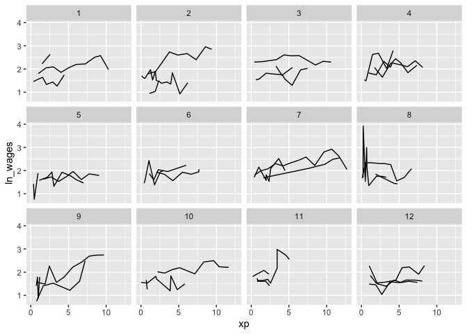
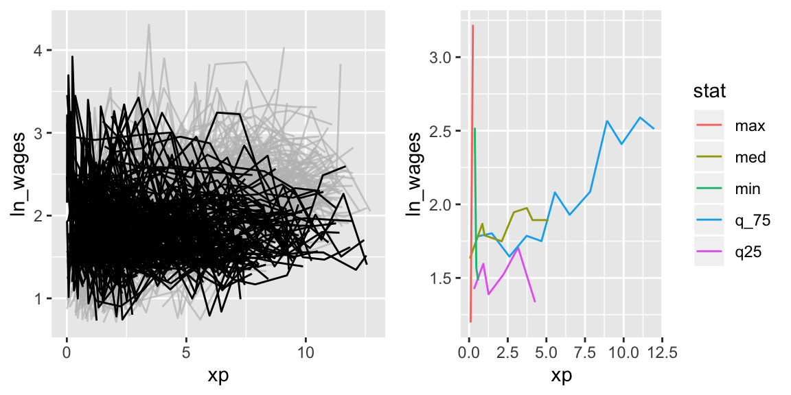

<!-- README.md is generated from README.Rmd. Please edit that file -->

# brolgar

<!-- badges: start -->

[](https://www.tidyverse.org/lifecycle/#experimental)
[](https://travis-ci.org/njtierney/brolgar)
[](https://ci.appveyor.com/project/njtierney/brolgar)
[](https://codecov.io/gh/njtierney/brolgar?branch=master)
<!-- badges: end -->

`brolgar` helps you **br**owse **o**ver **l**ongitudinal **d**ata
**g**raphically and **a**nalytically in **R**, by providing tools to:

  - Efficiently explore raw longitudinal data
  - Calculate features (summaries) for individual series
  - Evaluate diagnostics of statistical models

This helps you go from the “plate of spaghetti” plot on the left, to
“interesting observations” plot on the left.


## Installation

Install from [GitHub](https://github.com/) with:

``` r
# install.packages("remotes")
remotes::install_github("njtierney/brolgar")
```

# Using `brolgar`: We need to talk about data

To efficiently look at your longitudinal data, we assume it **is a time
series**, with **irregular** time periods between measurements. This
might seem strange, (that’s OK\!), so **remember these two things**:

1.  The **key** variable in your data is the **identifier** of your
    individuals or series.
2.  The **index** variable is the **time** component of your data.

Together, the **index** and **key** uniquely identify an observation.

The term `key` is used a lot in brolgar, so it is an important idea to
internalise:

> **The key is the identifier of your individuals or series**

So in the `wages` data, we have the following setup:

``` r
wages <- as_tsibble(x = wages,
                       key = id,
                       index = xp,
                       regular = FALSE)
```

Here `as_tsibble()` takes wages, and a `key`, and `index`, and we state
the `regular = FALSE` (since there are not regular time periods between
measurements).

This is done using `as_tsibble`, which turns out data into a `tsibble`
object - a powerful data abstraction made available in the
[`tsibble`](https://tsibble.tidyverts.org/) package by [Earo
Wang](https://earo.me/), if you would like to learn more about
`tsibble`, see the [official package
documentation](https://tsibble.tidyverts.org/) or read [the
paper](https://arxiv.org/abs/1901.10257).

If you want to learn more about what longitudinal data as a time series,
you can [read more in the vignette, “Longitudinal Data
Structures”](http://brolgar.njtierney.com/articles/longitudinal-data-structures.html).

## Efficiently exploring longitudinal data

Exploring longitudinal data can be challenging when there are many
individuals. It is difficult to look at all of them\!

You often get a “plate of spaghetti” plot, with many lines plotted on
top of each other. You can avoid the spaghetti by looking at a random
subset of the data using tools in `brolgar`.

### `sample_n_keys()`

In `dplyr`, you can use `sample_n()` to sample `n` observations, or
`sample_frac()` to look at a `frac`tion of observations.

`brolgar` builds on this providing `sample_n_keys()` and
`sample_frac_keys()`. This allows you to take a random sample of `n`
keys using `sample_n_keys()`. For example:

``` r
set.seed(2019-7-15-1300)
wages %>%
  sample_n_keys(size = 5) %>%
  ggplot(aes(x = xp,
             y = ln_wages,
             group = id)) + 
  geom_line()
```


And what if you want to create many of these plots?

## Clever facets: `facet_sample()`

`brolgar` provides some clever facets to help make it easier to explore
your data.

One issue when making `facet_sample()` allows you to specify the number
of keys per facet, and the number of facets with `n_per_facet` and
`n_facets`. It splits the data into 12 facets with 5 per facet by
default:

``` r
set.seed(2019-07-23-1937)
ggplot(wages,
       aes(x = xp,
           y = ln_wages,
           group = id)) +
  geom_line() +
  facet_sample()
```



Under the hood, this facet is powered by `sample_n_keys()` and
`stratify_keys()`.

You can see other facets (e.g., `facet_strata`) and data visualisations
you can make in brolgar in the [Visualisation
Gallery](http://brolgar.njtierney.com/articles/visualisation-gallery.html).

## Finding features in longitudinal data

You can extract `features` of longitudinal data using the `features`
function, from [`fabletools`](http://fabletools.tidyverts.org/). These
features all begin with `feat_`. You can, for example, find those whose
values only increase or decrease with `feat_monotonic`:

``` r
wages %>%
  features(ln_wages, feat_monotonic)
#> # A tibble: 888 x 5
#>       id increase decrease unvary monotonic
#>    <int> <lgl>    <lgl>    <lgl>  <lgl>    
#>  1    31 FALSE    FALSE    FALSE  FALSE    
#>  2    36 FALSE    FALSE    FALSE  FALSE    
#>  3    53 FALSE    FALSE    FALSE  FALSE    
#>  4   122 FALSE    FALSE    FALSE  FALSE    
#>  5   134 FALSE    FALSE    FALSE  FALSE    
#>  6   145 FALSE    FALSE    FALSE  FALSE    
#>  7   155 FALSE    FALSE    FALSE  FALSE    
#>  8   173 FALSE    FALSE    FALSE  FALSE    
#>  9   206 TRUE     FALSE    FALSE  TRUE     
#> 10   207 FALSE    FALSE    FALSE  FALSE    
#> # … with 878 more rows
```

You can read more about creating and using features in the [Finding
Features](http://brolgar.njtierney.com/articles/finding-features.html)
vignette.

## Linking individuals back to the data

Once you have created these features, you can join them back to the data
with a `left_join`, like so:

``` r
wages %>%
  features(ln_wages, feat_monotonic) %>%
  left_join(wages, by = "id") %>%
  ggplot(aes(x = xp,
             y = ln_wages,
             group = id)) +
  geom_line() + 
  gghighlight(increase)
```


# Other helper functions

## `n_obs()`

Return the number of observations total with `n_obs()`:

``` r
n_obs(wages)
#> n_obs 
#>  6402
```

## `n_keys()`

And the number of keys in the data using `n_keys()`:

``` r
n_keys(wages)
#> [1] 888
```

## Finding the number of observations per `key`.

You can also use `n_obs()` inside features to return the number of
observations for each key:

``` r
wages %>%
  features(id, n_obs)
#> # A tibble: 888 x 2
#>       id n_obs
#>    <int> <int>
#>  1    31     8
#>  2    36    10
#>  3    53     8
#>  4   122    10
#>  5   134    12
#>  6   145     9
#>  7   155    11
#>  8   173     6
#>  9   206     3
#> 10   207    11
#> # … with 878 more rows
```

This returns a dataframe, with one row per key, and the number of
observations for each key.

This could be further summarised to get a sense of the patterns of the
number of observations:

``` r
library(ggplot2)
wages %>%
  features(id, n_obs) %>%
  ggplot(aes(x = n_obs)) + 
    geom_bar()
```


``` r

wages %>%
  features(id, n_obs) %>%
  summary()
#>        id            n_obs       
#>  Min.   :   31   Min.   : 1.000  
#>  1st Qu.: 3332   1st Qu.: 5.000  
#>  Median : 6666   Median : 8.000  
#>  Mean   : 6343   Mean   : 7.209  
#>  3rd Qu.: 9194   3rd Qu.: 9.000  
#>  Max.   :12543   Max.   :13.000
```

# Further Reading

`brolgar` provides other useful functions to explore your data, which
you can read about in the [exploratory
modelling](http://brolgar.njtierney.com/articles/exploratory-modelling.html)
and [Identify Interesting
Observations](http://brolgar.njtierney.com/articles/id-interesting-obs.html)
vignettes. As a taster, here are some of the figures you can produce:



# Related work

One of the sources of inspiration for this work was the [`lasangar` R
package by Bryan Swihart](https://github.com/swihart/lasagnar) (and
[paper](https://www.ncbi.nlm.nih.gov/pmc/articles/PMC2937254/)).

For even more expansive time series summarisation, make sure you check
out the [`feasts` package](https://github.com/tidyverts/feasts) (and
[talk\!](https://slides.mitchelloharawild.com/user2019/#1)).

# Contributing

Please note that the `brolgar` project is released with a [Contributor
Code of Conduct](.github/CODE_OF_CONDUCT.md). By contributing to this
project, you agree to abide by its terms.

# A Note on the API

This version of brolgar was been forked from
[tprvan/brolgar](https://github.com/tprvan/brolgar), and has undergone
breaking changes to the API.

# Acknowledgements

Thank you to [Mitchell O’Hara-Wild](https://mitchelloharawild.com/) and
[Earo Wang](https://earo.me/) for many useful discussions on the
implementation of brolgar, as it was heavily inspired by the
[`feasts`](https://github.com/tidyverts/feasts) package from the
[`tidyverts`](https://tidyverts.org/). I would also like to thank [Tania
Prvan](https://researchers.mq.edu.au/en/persons/tania-prvan) for her
valuable early contributions to the project, as well as [Stuart
Lee](https://stuartlee.org/) for helpful discussions.

<!-- These are referred to as a **longnostics**, a portmanteau of **long**itudinal and **cognostic**. These **longnostics** make it straightforward to extract subjects with certain properties to gain some insight into the data.  -->

<!-- But calculating this for individuals draws you away from your analysis, and instead you are now wrangling with a different problem: summarising key information about each individual and incorporating that back into the data.  -->
