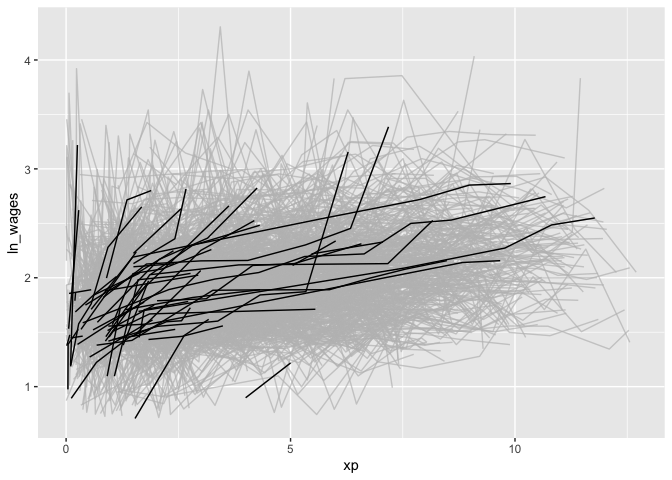

<!-- README.md is generated from README.Rmd. Please edit that file -->

# brolgar

**br**owse **o**ver **l**ongitudinal **d**ata **g**raphically and
**a**nalytically in **R**

<!-- badges: start -->

[](https://travis-ci.org/njtierney/brolgar)
[](https://ci.appveyor.com/project/njtierney/brolgar)
[](https://codecov.io/gh/njtierney/brolgar?branch=master)
[](https://www.tidyverse.org/lifecycle/#experimental)
<!-- badges: end -->

Exploring longitudinal data can be challenging. For example, when there
are many individuals it is difficult to look at all of them, as you
often get a “plate of spaghetti” plot, with many lines plotted on top of
each other.

``` r
library(brolgar)
#> Loading required package: tsibble
library(ggplot2)
ggplot(wages, 
       aes(x = xp, 
             y = ln_wages, 
             group = id)) + 
  geom_line()
```


These are hard to interpret.

What you want is to identify those interesting individual lines, so you
can get something like the following:


`brolgar` helps you **br**owse **o**ver **l**ongitudinal **d**ata
**g**raphically and **a**nalytically in **R**, by providing tools to:

  - Calculate features (summaries) for each individual series
  - Efficiently explore your raw data
  - Evaluate diagnostics of statistical models

## Installation

Install from [GitHub](https://github.com/) with:

``` r
# install.packages("remotes")
remotes::install_github("njtierney/brolgar")
```

# Data in `brolgar`

To efficiently look at your longitudinal data, we assume it **is a time
series**, with irregular time periods between measurements. This might
seem strange, (that’s OK\!), but there are **two important things** to
remember:

1.  The **key** variable in your data is the **identifier** of your
    individuals or series.
2.  The **index** variable is the **time** component of your data.

Together, the **index** and **key** uniquely identify an observation.

The term `key` is used a lot in brolgar, so it is an important idea to
internalise:

> **The key is the identifier of your individuals or series**

So in the `wages` data, we have the following setup:

``` r
wages <- as_tsibble(x = wages,
                       key = id,
                       index = xp,
                       regular = FALSE)
```

If you want to learn more about what longitudinal data as a time series,
you can [read more in the vignette, “Longitudinal Data
Structures”](library/brolgar/html/longitudinal-data-structures.html)

## Efficiently exploring longitudinal data

To avoid staring at a plate of spaghetti, you can look at a random
subset of the data. Brolgar provides some intuitive functions to help
with this.

### `sample_n_keys()`

In `dplyr`, you can use `sample_n()` to sample `n` observations.
Similarly, with `brolgar`, you can take a random sample of `n` keys
using `sample_n_keys()`:

``` r
set.seed(2019-7-15-1300)
wages %>%
  sample_n_keys(size = 10) %>%
  ggplot(aes(x = xp,
             y = ln_wages,
             group = id)) + 
  geom_line()
```


## Filtering observations

You can combine `sample_n_keys()` with `filter_n_obs` to only show keys
with many observations:

``` r
set.seed(2019-7-15-1259)
wages %>%
  filter_n_obs(n_obs > 5) %>%
  sample_n_keys(size = 10) %>%
  ggplot(aes(x = xp,
             y = ln_wages,
             group = id)) + 
  geom_line()
```


(Note: `sample_frac_keys()`, which samples a fraction of available
keys.)

Now, how do you break these into many plots?

## Clever facets: `facet_strata()`

`brolgar` provides some clever facets to help make it easier to explore
your data. `facet_strata()` splits the data into 12 groups by default:

``` r
set.seed(2019-07-23-1936)
library(ggplot2)
ggplot(wages,
       aes(x = xp,
           y = ln_wages,
           group = id)) +
  geom_line() +
  facet_strata()
```


But you could ask it to split the data into a more groups

``` r
set.seed(2019-07-25-1450)
library(ggplot2)
ggplot(wages,
       aes(x = xp,
           y = ln_wages,
           group = id)) +
  geom_line() +
  facet_strata(n_strata = 20)
```


And what if you want to show only a few samples per facet?

## Clever facets: `facet_sample()`

`facet_sample()` allows you to specify the number of keys per facet, and
the number of facets with `n_per_facet` and `n_facets`. It splits the
data into 12 facets with 5 per facet by default:

``` r
set.seed(2019-07-23-1937)
ggplot(wages,
       aes(x = xp,
           y = ln_wages,
           group = id)) +
  geom_line() +
  facet_sample()
```


But you can specify your own number:

``` r
set.seed(2019-07-25-1527)
ggplot(wages,
       aes(x = xp,
           y = ln_wages,
           group = id)) +
  geom_line() +
  facet_sample(n_per_facet = 3,
               n_facets = 20)
```


Under the hood, `facet_sample()` and `facet_strata()` use
`sample_n_keys()` and `stratify_keys()`.

## Exploratory modelling

You can fit a linear model for each key using `key_slope()`. This
returns the intercept and slope estimate for each key, given some linear
model formula. We can get the number of observations, and slope
information for each individual to identify those that are decreasing
over time.

``` r
key_slope(wages,ln_wages ~ xp)
#> # A tibble: 888 x 3
#>       id .intercept .slope_xp
#>    <int>      <dbl>     <dbl>
#>  1    31       1.41    0.101 
#>  2    36       2.04    0.0588
#>  3    53       2.29   -0.358 
#>  4   122       1.93    0.0374
#>  5   134       2.03    0.0831
#>  6   145       1.59    0.0469
#>  7   155       1.66    0.0867
#>  8   173       1.61    0.100 
#>  9   206       1.73    0.180 
#> 10   207       1.62    0.0884
#> # … with 878 more rows
```

We can then join these summaries back to the data:

``` r
library(dplyr)
wages_slope <- key_slope(wages,ln_wages ~ xp) %>%
  left_join(wages, by = "id") 

wages_slope
#> # A tibble: 6,402 x 11
#>       id .intercept .slope_xp ln_wages    xp   ged xp_since_ged black
#>    <int>      <dbl>     <dbl>    <dbl> <dbl> <int>        <dbl> <int>
#>  1    31       1.41    0.101      1.49 0.015     1        0.015     0
#>  2    31       1.41    0.101      1.43 0.715     1        0.715     0
#>  3    31       1.41    0.101      1.47 1.73      1        1.73      0
#>  4    31       1.41    0.101      1.75 2.77      1        2.77      0
#>  5    31       1.41    0.101      1.93 3.93      1        3.93      0
#>  6    31       1.41    0.101      1.71 4.95      1        4.95      0
#>  7    31       1.41    0.101      2.09 5.96      1        5.96      0
#>  8    31       1.41    0.101      2.13 6.98      1        6.98      0
#>  9    36       2.04    0.0588     1.98 0.315     1        0.315     0
#> 10    36       2.04    0.0588     1.80 0.983     1        0.983     0
#> # … with 6,392 more rows, and 3 more variables: hispanic <int>,
#> #   high_grade <int>, unemploy_rate <dbl>
```

And highlight those individuals with a negative slope using
`gghighlight`:

``` r
library(gghighlight)

wages_slope %>% 
  as_tibble() %>% # workaround for gghighlight + tsibble
  ggplot(aes(x = xp, 
             y = ln_wages, 
             group = id)) + 
  geom_line() +
  gghighlight(.slope_xp < 0)
```


### Find keys near other summaries with `keys_near()`

We could take our slope information and find those individuals who are
representative of the min, median, maximum, etc of growth, using
`keys_near()`:

``` r
wages_slope %>%
  keys_near(key = id,
            var = .slope_xp,
            funs = l_three_num)
#> # A tibble: 13 x 5
#> # Groups:   stat [3]
#>       id .slope_xp stat  stat_value stat_diff
#>    <int>     <dbl> <chr>      <dbl>     <dbl>
#>  1  7918   -4.58   min      -4.58           0
#>  2  7918   -4.58   min      -4.58           0
#>  3  7918   -4.58   min      -4.58           0
#>  4  6863    0.0452 med       0.0452         0
#>  5  6863    0.0452 med       0.0452         0
#>  6  6863    0.0452 med       0.0452         0
#>  7  6863    0.0452 med       0.0452         0
#>  8  6863    0.0452 med       0.0452         0
#>  9  6863    0.0452 med       0.0452         0
#> 10  6863    0.0452 med       0.0452         0
#> 11  6863    0.0452 med       0.0452         0
#> 12 12455   13.2    max      13.2            0
#> 13 12455   13.2    max      13.2            0
```

``` r
wages_slope %>%
  keys_near(key = id,
            var = .slope_xp,
            funs = l_three_num) %>%
  left_join(wages, by = "id") %>%
  ggplot(aes(x = xp,
             y = ln_wages,
             group = id,
             colour = stat)) + 
  geom_line()
```


## Finding features in longitudinal data

You can extract `features` of longitudinal data using the `features`
function, from `fablelite`. You can, for example, calculate the minimum
of a given variable for each key by providing a named list like so:

``` r
wages %>%
  features(ln_wages, 
           list(min = min))
#> # A tibble: 888 x 2
#>       id   min
#>    <int> <dbl>
#>  1    31 1.43 
#>  2    36 1.80 
#>  3    53 1.54 
#>  4   122 0.763
#>  5   134 2.00 
#>  6   145 1.48 
#>  7   155 1.54 
#>  8   173 1.56 
#>  9   206 2.03 
#> 10   207 1.58 
#> # … with 878 more rows
```

`brolgar` provides some sets of features, which start with `feat_`.

For example, the five number summary is `feat_five_num`:

``` r
wages %>%
  features(ln_wages, feat_five_num)
#> # A tibble: 888 x 6
#>       id   min   q25   med   q75   max
#>    <int> <dbl> <dbl> <dbl> <dbl> <dbl>
#>  1    31 1.43   1.48  1.73  2.02  2.13
#>  2    36 1.80   1.97  2.32  2.59  2.93
#>  3    53 1.54   1.58  1.71  1.89  3.24
#>  4   122 0.763  2.10  2.19  2.46  2.92
#>  5   134 2.00   2.28  2.36  2.79  2.93
#>  6   145 1.48   1.58  1.77  1.89  2.04
#>  7   155 1.54   1.83  2.22  2.44  2.64
#>  8   173 1.56   1.68  2.00  2.05  2.34
#>  9   206 2.03   2.07  2.30  2.45  2.48
#> 10   207 1.58   1.87  2.15  2.26  2.66
#> # … with 878 more rows
```

Or finding those whose values only increase or decrease with
`feat_monotonic`

``` r
wages %>%
  features(ln_wages, feat_monotonic)
#> # A tibble: 888 x 5
#>       id increase decrease unvary monotonic
#>    <int> <lgl>    <lgl>    <lgl>  <lgl>    
#>  1    31 FALSE    FALSE    FALSE  FALSE    
#>  2    36 FALSE    FALSE    FALSE  FALSE    
#>  3    53 FALSE    FALSE    FALSE  FALSE    
#>  4   122 FALSE    FALSE    FALSE  FALSE    
#>  5   134 FALSE    FALSE    FALSE  FALSE    
#>  6   145 FALSE    FALSE    FALSE  FALSE    
#>  7   155 FALSE    FALSE    FALSE  FALSE    
#>  8   173 FALSE    FALSE    FALSE  FALSE    
#>  9   206 TRUE     FALSE    FALSE  TRUE     
#> 10   207 FALSE    FALSE    FALSE  FALSE    
#> # … with 878 more rows
```

## Linking individuals back to the data

You can join these features back to the data with `left_join`, like so:

``` r
wages %>%
  features(ln_wages, feat_monotonic) %>%
  left_join(wages, by = "id") %>%
  ggplot(aes(x = xp,
             y = ln_wages,
             group = id)) +
  geom_line() + 
  gghighlight(increase)
```



## Other helper functions

### `n_key_obs()`

We can calculate the number of observations for each `key`, using
`n_key_obs()`:

``` r
n_key_obs(wages)
#> # A tibble: 888 x 2
#>       id n_obs
#>    <int> <int>
#>  1    31     8
#>  2    36    10
#>  3    53     8
#>  4   122    10
#>  5   134    12
#>  6   145     9
#>  7   155    11
#>  8   173     6
#>  9   206     3
#> 10   207    11
#> # … with 878 more rows
```

This returns a dataframe, with one row per key, and the number of
observations for each key.

This could be further summarised to get a sense of the patterns of the
number of observations:

``` r
library(ggplot2)
n_key_obs(wages) %>%
ggplot(aes(x = n_obs)) + 
  geom_bar()
```


``` r

n_key_obs(wages) %>% summary()
#>        id            n_obs       
#>  Min.   :   31   Min.   : 1.000  
#>  1st Qu.: 3332   1st Qu.: 5.000  
#>  Median : 6666   Median : 8.000  
#>  Mean   : 6343   Mean   : 7.209  
#>  3rd Qu.: 9194   3rd Qu.: 9.000  
#>  Max.   :12543   Max.   :13.000
```

### `add_n_key_obs()`

You can add information about the number of observations for each key
with `add_n_key_obs()`:

``` r
wages %>% add_n_key_obs()
#> # A tsibble: 6,402 x 10 [!]
#> # Key:       id [888]
#>       id    xp n_obs ln_wages   ged xp_since_ged black hispanic high_grade
#>    <int> <dbl> <int>    <dbl> <int>        <dbl> <int>    <int>      <int>
#>  1    31 0.015     8     1.49     1        0.015     0        1          8
#>  2    31 0.715     8     1.43     1        0.715     0        1          8
#>  3    31 1.73      8     1.47     1        1.73      0        1          8
#>  4    31 2.77      8     1.75     1        2.77      0        1          8
#>  5    31 3.93      8     1.93     1        3.93      0        1          8
#>  6    31 4.95      8     1.71     1        4.95      0        1          8
#>  7    31 5.96      8     2.09     1        5.96      0        1          8
#>  8    31 6.98      8     2.13     1        6.98      0        1          8
#>  9    36 0.315    10     1.98     1        0.315     0        0          9
#> 10    36 0.983    10     1.80     1        0.983     0        0          9
#> # … with 6,392 more rows, and 1 more variable: unemploy_rate <dbl>
```

Which you can then use to filter observations:

``` r
wages %>% 
  add_n_key_obs() %>%
  filter(n_obs > 3)
#> # A tsibble: 6,145 x 10 [!]
#> # Key:       id [764]
#>       id    xp n_obs ln_wages   ged xp_since_ged black hispanic high_grade
#>    <int> <dbl> <int>    <dbl> <int>        <dbl> <int>    <int>      <int>
#>  1    31 0.015     8     1.49     1        0.015     0        1          8
#>  2    31 0.715     8     1.43     1        0.715     0        1          8
#>  3    31 1.73      8     1.47     1        1.73      0        1          8
#>  4    31 2.77      8     1.75     1        2.77      0        1          8
#>  5    31 3.93      8     1.93     1        3.93      0        1          8
#>  6    31 4.95      8     1.71     1        4.95      0        1          8
#>  7    31 5.96      8     2.09     1        5.96      0        1          8
#>  8    31 6.98      8     2.13     1        6.98      0        1          8
#>  9    36 0.315    10     1.98     1        0.315     0        0          9
#> 10    36 0.983    10     1.80     1        0.983     0        0          9
#> # … with 6,135 more rows, and 1 more variable: unemploy_rate <dbl>
```

Alternatively, you can use the shortcut, `filter_n_obs()`:

``` r
wages %>% 
  filter_n_obs(n_obs > 3)
#> # A tsibble: 6,145 x 10 [!]
#> # Key:       id [764]
#>       id    xp n_obs ln_wages   ged xp_since_ged black hispanic high_grade
#>    <int> <dbl> <int>    <dbl> <int>        <dbl> <int>    <int>      <int>
#>  1    31 0.015     8     1.49     1        0.015     0        1          8
#>  2    31 0.715     8     1.43     1        0.715     0        1          8
#>  3    31 1.73      8     1.47     1        1.73      0        1          8
#>  4    31 2.77      8     1.75     1        2.77      0        1          8
#>  5    31 3.93      8     1.93     1        3.93      0        1          8
#>  6    31 4.95      8     1.71     1        4.95      0        1          8
#>  7    31 5.96      8     2.09     1        5.96      0        1          8
#>  8    31 6.98      8     2.13     1        6.98      0        1          8
#>  9    36 0.315    10     1.98     1        0.315     0        0          9
#> 10    36 0.983    10     1.80     1        0.983     0        0          9
#> # … with 6,135 more rows, and 1 more variable: unemploy_rate <dbl>
```

### `stratify_keys()`

To look at as much of the raw data as possible, it can be helpful to
stratify the data into groups for plotting. You can `stratify` the
`keys` using the `stratify_keys()` function, which adds the column,
`.strata`:

``` r
wages %>%
  sample_n_keys(100) %>% 
  stratify_keys(n_strata = 10)
#> # A tsibble: 677 x 10 [!]
#> # Key:       id [100]
#>       id ln_wages    xp   ged xp_since_ged black hispanic high_grade
#>    <int>    <dbl> <dbl> <int>        <dbl> <int>    <int>      <int>
#>  1   122    2.12   2.04     0            0     0        0         12
#>  2   122    2.92   2.64     0            0     0        0         12
#>  3   122    1.92   3.66     0            0     0        0         12
#>  4   122    0.763  4.64     0            0     0        0         12
#>  5   122    2.44   5.83     0            0     0        0         12
#>  6   122    2.18   6.72     0            0     0        0         12
#>  7   122    2.14   8.16     0            0     0        0         12
#>  8   122    2.20   9.1      0            0     0        0         12
#>  9   122    2.34  10.4      0            0     0        0         12
#> 10   122    2.67  11.1      0            0     0        0         12
#> # … with 667 more rows, and 2 more variables: unemploy_rate <dbl>,
#> #   .strata <int>
```

This then allows the user to create facetted plots showing a lot more of
the raw data

``` r
set.seed(2019-07-15-1258)
wages %>%
  sample_n_keys(120) %>% 
  stratify_keys(n_strata = 12) %>%
  ggplot(aes(x = xp,
             y = ln_wages,
             group = id)) + 
  geom_line() + 
  facet_wrap(~.strata)
```


# Contributing

Please note that the `brolgar` project is released with a [Contributor
Code of Conduct](.github/CODE_OF_CONDUCT.md). By contributing to this
project, you agree to abide by its terms.

# A Note on the API

This version of brolgar was been forked from
[tprvan/brolgar](https://github.com/tprvan/brolgar), and has undergone
breaking changes to the API.

<!-- These are referred to as a **longnostics**, a portmanteau of **long**itudinal and **cognostic**. These **longnostics** make it straightforward to extract subjects with certain properties to gain some insight into the data.  -->

<!-- But calculating this for individuals draws you away from your analysis, and instead you are now wrangling with a different problem: summarising key information about each individual and incorporating that back into the data.  -->

<!-- This is annoying, and distracts from your analysis, inviting errors. -->
